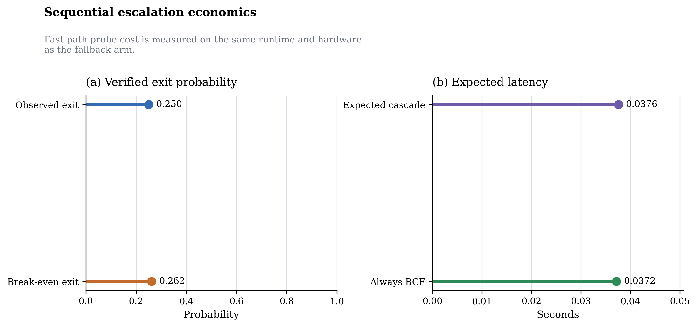

# VSA Recoverability Atlas

An empirical, reproducible atlas of when recoverability in Vector Symbolic Architectures improves and which extra resource actually pays for that reliability.

## Status

- Current preprint branch: `publication/preprint-v1`
- Current manuscript state: validated reviewer preprint source and deterministic local PDF build
- Scope: bounded empirical claims only; no universal substrate claim and no production-readiness claim

## Key Findings

- The atlas consolidates `24` normalized research lines under a frozen systematic mapping and claim ledger.
- In the clean common `F = 3` envelope, the tested native BCF arm covered hard pooled cases that defeated the tested MAP baselines.
- The tested MAP arm retained a latency advantage on easier cells but not a universal recovery advantage.
- Sequential escalation remained economically unfavorable in the measured clean non-easy subset because the observed verified exit rate stayed below the measured break-even threshold.
- Multiple repair and representation ideas improved local statistics without creating a new nondominated operating point once storage, compute, verification, and transfer costs were charged.
- The repository does not support a universal substrate ranking or a blanket production claim.

## Main Figure



## Why This Matters

Recoverability in VSA/HDC systems is often discussed as if it were a property of the algebra alone. This repository shows a narrower and more useful picture: stronger recovery repeatedly appeared only when the system paid in some identifiable currency such as exact side information, more dimensions, more bits, stronger native structure, more decoder compute, tighter routing priors, hardware support, or reduced coverage through abstention.

## Repository Contents

- [paper/manuscript.md](paper/manuscript.md): canonical manuscript source
- [paper/evidence_registry.yaml](paper/evidence_registry.yaml): machine-readable evidence source of truth
- [paper/claim_ledger.md](paper/claim_ledger.md): public claim boundaries and support map
- [paper/failure_mode_atlas.md](paper/failure_mode_atlas.md): normalized failure signatures and mitigations
- [paper/supplementary_evidence_atlas.md](paper/supplementary_evidence_atlas.md): supplementary atlas and registry-heavy detail
- [REPRODUCIBILITY.md](REPRODUCIBILITY.md): setup, validation, and rerun guidance
- [results](results): frozen and development result artifacts
- [docs](docs): preserved protocol and lineage materials

## Reproduce The Paper

Use the project virtual environment and build the reviewer preprint from source:

```powershell
py -3.14 -m venv .venv
.\.venv\Scripts\python -m pip install --upgrade pip
.\.venv\Scripts\python -m pip install -e .
.\.venv\Scripts\python scripts\build_evidence_tables.py
.\.venv\Scripts\python scripts\validate_evidence_registry.py
.\.venv\Scripts\python -m pytest -q
.\.venv\Scripts\python scripts\build_manuscript.py --profile reviewer-preprint
.\.venv\Scripts\python scripts\validate_manuscript_pdf.py --release paper\release_candidate\VSA_Recoverability_Atlas_<commit>.pdf
```

Detailed build notes are in [paper/BUILDING.md](paper/BUILDING.md).

## Evidence And Claim Discipline

- Claims are bounded to explicit task contracts, decoder assumptions, and tested envelopes.
- Negative results are retained rather than hidden.
- Historical protocol artifacts are preserved for auditability, but the main paper uses reader-facing scientific prose.
- Primary evidence is tracked in the registry, claim ledger, bibliography, and deterministic figure/table generation scripts.

## Paper

- Manuscript source: [paper/manuscript.md](paper/manuscript.md)
- Release-candidate source bundle: [paper/release_candidate](paper/release_candidate)
- Suggested title: `Recoverability Has a Cost: An Empirical Atlas and Resource-Aware Design Framework for Vector Symbolic Architectures`

## Citation

Citation metadata is provided in [CITATION.cff](CITATION.cff).

## License

License text is in [LICENSE](LICENSE). Scope notes for scholarly assets and third-party materials are in [LICENSE_SCOPE.md](LICENSE_SCOPE.md) and [THIRD_PARTY_NOTICES.md](THIRD_PARTY_NOTICES.md).
